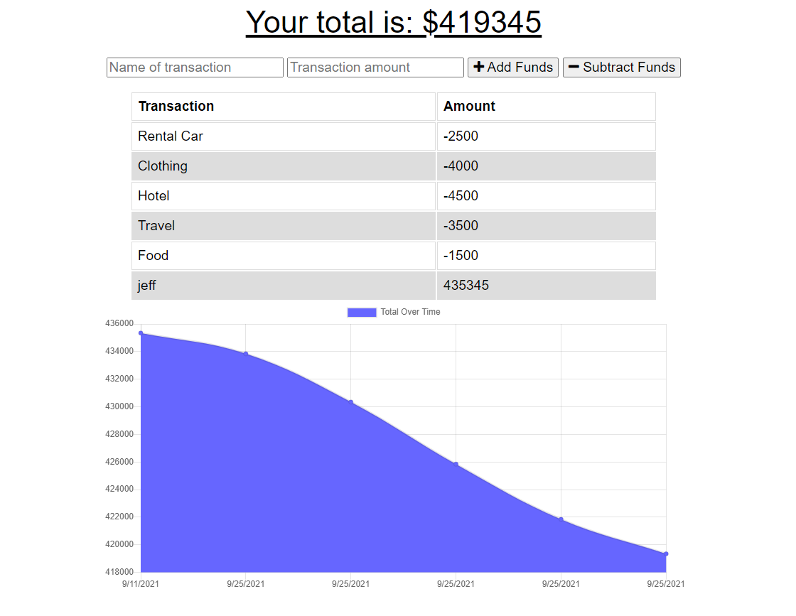

# BudgetTracker

## Description

- To give user a easier way to follow a budget
- This project was developed to help the user understand how to budget in a fun way
- Having a budget tracker can give the user better insight on how they spend their money.

## Table of Contents

- [Installation](#installation)

- [Usage](#usage)

- [License](#license)

## Installation
>The first thing you need to do is to go into Github and create a Repo. 

>Then install npm inquirer

>Then create a functional service-worker.js file

## Usage

  

## License

 [Apache](http://www.apache.org/licenses/)
---